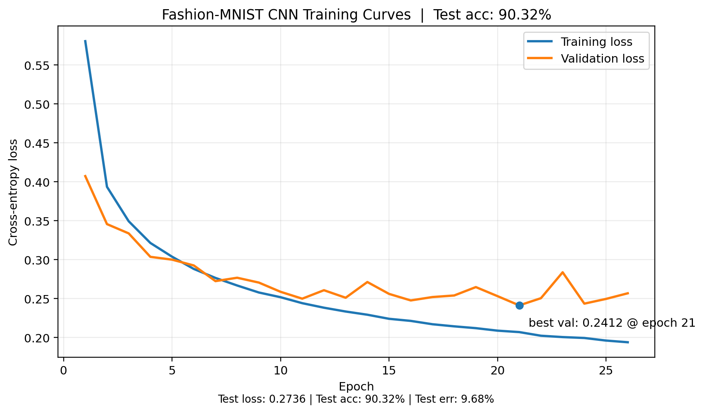

## Convolutional Neural Network (CNN) Implementation for Fashion MNIST Dataset

This repository contains a from-scratch implementaion of a CNN for the Fasion MNIST dataset.

### Running the model

1. Clone the repo onto your local machine.
2. Download the Fashion MNIST dataset [https://www.kaggle.com/datasets/zalando-research/fashionmnist](https://www.kaggle.com/datasets/zalando-research/fashionmnist) and copy the idx1 and idx3 files into the root directory of the project.
3. Ensure make and clang are installed on your machine.
4. Open a shell in the root directory and enter the command `$ make all`
5. Enter the command `$ make test` to run the program.

### Network Architecture
- Input 1x28x28
- Convolution2D 8x28x28 (8 filters)
- ReLU
- MaxPool (2x2) 8x14x14
- Convolution2D 16x14x14 (16 filters)
- ReLU
- MaxPool (2x2) 16x7x7
- Flatten -> 784
- Fully Connected 784x10
- Softmax + Cross-Entropy

Adam (with SGD) is used as the training algorithm as it is decribed in Ian Goodfellows Deep learning book.
Additionally, it makes use of early stopping and a validation set, restoring parameters to the ones with the lowest
averge validation error when patience is exceeded.

### Hyperparameters
- training step: epsilon = 0.001
- first-moment decay: rho1 = 0.9
- second-moment decay: rho2 = 0.999
- patience: n = 5

### Results

With the above hyperparameters and architecture, this program achieves a 90.32% accuracy in classifying the Fashion MNIST dataset.